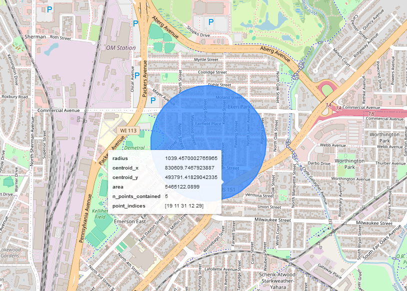

# Micro-Time Hot Spot Identification

A Python package for identifying Micro-Time Hot Spots (MTHS) using Shapely and other Python libraries. 

## Background

According to researchers Rachel and Roberto Santos, micro-time hot spots are short-term clusters of near-repeat crimes often committed by the same offender(s). Addressing this kind of crime may be part of an overall crime reduction strategy. By identifying these clusters early, police may activate a response to the area which can have a dampening effect on subsequent crime. 

The micro-time hot spot cluster is identified with three main components: 
<ul>
  <li># of days</li>
  <li># of crimes</li>
  <li>radius of hot spot</li>
</ul>

For this package, it is assumed that the user has gathered crime data with corresponding coordinate points from a predetermined set of days (generally 10 to 14). Those points are supplied to the class and processed using the events and radius arguments. Only clusters of crimes that are greater than or equal to the number of events and that exist within a circle with a radius less than or equal to the desired radius will be returned.


## Installation

Install the package via pip:

```
pip install mths_package
```

or from source:

```
git clone https://github.com/yourusername/mths_package.git
cd mths_package
python setup.py install
```

## Dependencies
Shapely >= 2.0.0
GEOS >= 3.8
NumPy >= 1.26.4


## Usage
Provide a list of coordinate points as input. The points should be a list/tuple of x,y coordinates. 
```python
from microtime_hotspots import MTHS

points = [(0, 0), (1, 1), (2, 2), (3, 3)]
mths_instance = MTHS(points, events=2, radius=1)
mths_instance.process()
print(mths_instance.mths)
```

If you have a dataframe or geodataframe with x and y, you may supply the points as seen here. The class will convert them to Shapely Points.
```python
points = [x for x in zip(df['x'], df['y'])]
```

If GeoPandas is install, you can easily view a geodataframe of any resulting MTHS (be sure to set the CRS for your data)
```python
mths_gdf = gpd.GeoDataFrame(pd.DataFrame(mths.mths), geometry=pd.DataFrame(mths.mths)['geometry'], crs='EPSG:8193')
```
And explore the results on a map
```python
mths_gdf.explore()
```


